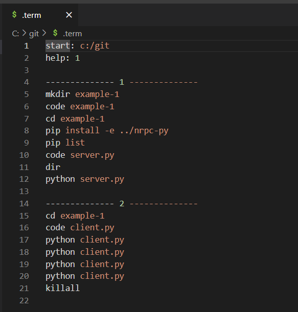

# Native RPC (Main documentation and usage examples)

Cross-platform and cross-language communication library that rethinks the way we build distributed systems and handle communication between remote processes. 

Solution draws motivation from many well-established solutions: 

- REST
- Swagger schemas
- Typescript's json interfaces
- Python's TypedDict
- GRPC
- Protobuf
- ROS
- RQT Graph
- GraphQL
- ZMQ
- JSON
- C#'s serialization tools, language reflection, annotations
- Node.JS's and Express's annotation based end-points 

image?

Primary focus of this approach is to provide a software developer tools and concerete implementation examples to tackle the every-day challenges of software development when dealing with:

- Distributed systems
    - Socket communication
- Network topology
    - Servers, clients, services, RPC methods, request/response structures, fields
- Centralized schema
    - Services, RPC methods, structures, fields
- System validation
    - Stable distributed system bringup
    - Error handling
- Negotiated serialization
    - JSON, protobuf, ROW, etc
- Cross-launguage support
    - C++, Python, Typescript, Webpack
- Cross-platform
    - Windows, Linux, Mac

image? 
network topology image?

Implementation consists of 5 GitHub repositories:

- nrpc-examples - Primary landing page for Native RPC. Describes the techonlogy and provides some usage examples.
- nrpc-cli - Devops command line tooling.
- nrpc-py - Python library, installed globally or inside a virtual python environment with "pip install nrpc-py".
- nrpc-ts - Typescript library, installed locally inside a project with "npm i nrpc-ts".
- nrpc-cpp - C++ library, installed locally with CMake configuration.

image?

Supported operating systems, programming environments, and programming languages:

- Windows
- Ubuntu
- Mac
- CMake
- Node.JS
- Webpack (internet browsers)
- C++
- Python
- Typescript

image?

Implementation consists of 5 classes:

- nprclass - Class annotation class, that is used to describe 5 things: request structures, reponse structures, class fields, remote services, service RPC methods.
- RoutingSocket - Handles serialization, routing, and error tracking. Bind- and Connect-style routing sockets are used to connects services with clients.
- ServerSocket - Similar to ZMQ's Router or WinSock's bind(). Uniquely identified by an IP address and port.
- ClientSocket - Same as Server Socket, but not uniquely identified by an IP and port.
- ServiceClient - Wrapper around a RoutingSocket. Acts like a client to a remote service.

image?

Related command line tooling:

- show - Show's and examines network topology and schema.
- term - Interactive multi-terminal launcher. Great for demoing.


# Getting started

CLI tooling setup:
```
git clone nrpc-cli...
```

Buliding:
```
cmake -B build
```

# Usage examples

## Tutorial 1

Step-by-step instructions for creating a simple server/client application that utilizes Native RPC framework in Python.
This tutorial relies on the command line utility `term`, which was installed in `Getting started` chapter.

We start by configuring a nice launcher dashboard by editing the `.term` configuration:

[](doc/1-term.png)

The dashboard can be opened by executing `term -ui` in one terminal and two `term`s in others:

[](doc/1-dash.png)

A blank VS Code solution can be created by executing `mkdir` and `code` commands:

[](doc/1-mkdir.png)

This opens a blank VS Code project:

[](doc/1-blank.png)

The only `nrpc-py` dependency can be installed with `pip install`:

[](doc/1-pip.png)

Installed dependencies can be validated with `pip list`:

[](doc/1-deps.png)


## Tutorial 2

???

Startup commands:
```
npx server_example/server.ts
```

## Cross-platform

???

Example recipes:
```
term -wt "cmake -B build" "npx server_example/server.ts"
```

# Copy pasta recipes

Getting started commands:
```
...
```

Server-client example:
```
term -wt "cmake -B build" "npx server_example/server.ts"
```

Cross-language example:
```
term -wt "cmake -B build" "npx server_example/server.ts"
```


# Visual resources

Visual resources and simple code examples below.

website?
github?
youtube about techonlogy?
youtube about setup?
youtube about example 1?
youtube about example 2?
youtube about example 3?
powerpoint?
