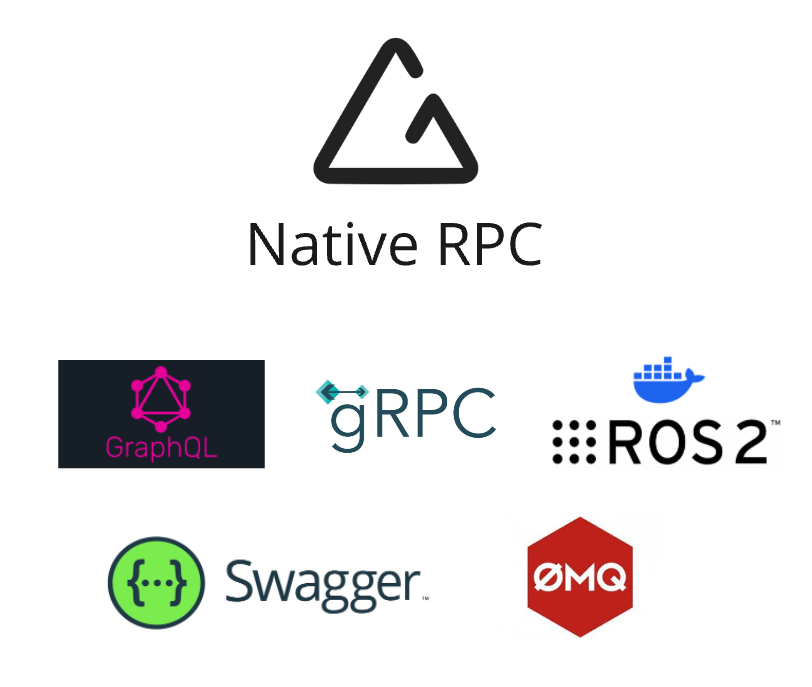
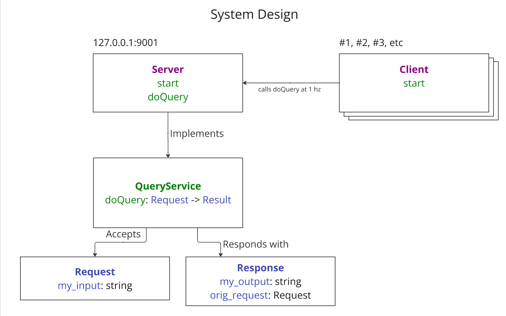

# Native RPC (documentation and tutorials)

Native RPC solution deals with many aspects of typical software development:

Native RPC is a Cross-platform and cross-language communication library that rethinks the way we build distributed systems and handle communication between local and remote processes. 

Solution draws inspiration from a wide-range of well-established and wide-spead solutions: 

- GRPC
- Protobuf
- ROS
- RQT Graph
- GraphQL
- ZMQ
- REST
- Swagger schemas
- Typescript's json interfaces
- Python's TypedDict
- JSON
- Sockets
- C#'s serialization tools, language reflection, annotations
- Node.JS's and Express's annotation based end-points 

[](doc/0-logos.png)

Solution relies heavily on class annotations:

[](doc/0-annotations.png)

Allowing for static typing of request and reponse parameters:

[](doc/0-annotations-static.png)

And:

[](doc/0-annotations-static.png)

Network topology can be examined with `term` command, via `Network` tab:

[](doc/0-term.png)

API schema can be examined with also:

[](doc/0-term-schema.png)

System is highly error-tolerant, able to visualize issues without crashing on application startup:

[](doc/0-term-validation.png)

# Additional details

Implementation consists of 5 GitHub repositories:

- [nrpc-examples](https://github.com/nativerpc/nrpc-examples) - Primary landing page for Native RPC. Describes the techonlogy and provides some usage examples.
- [nrpc-cli](https://github.com/nativerpc/nrpc-cli) - Devops command line tooling.
- [nrpc-py](https://github.com/nativerpc/nrpc-py) - Python library, installed globally or inside a virtual python environment with "pip install nrpc-py".
- [nrpc-ts](https://github.com/nativerpc/nrpc-ts) - Typescript library, installed locally inside a project with "npm i nrpc-ts".
- [nrpc-cpp](https://github.com/nativerpc/nrpc-cpp) - C++ library, installed locally with CMake configuration.

[](doc/0-repos.png)

Supported operating systems, programming environments, and programming languages:

- Windows
- Ubuntu
- Mac
- CMake
- Node.JS
- Webpack (internet browsers)
- C++
- Python
- Typescript

Implementation consists of 5 classes:

- nprclass - Class annotation class, that is used to describe 5 things: request structures, reponse structures, class fields, remote services, service RPC methods.
- RoutingSocket - Handles serialization, routing, and error tracking. Bind- and Connect-style routing sockets are used to connects services with clients.
- ServerSocket - Similar to ZMQ's Router or WinSock's bind(). Uniquely identified by an IP address and port.
- ClientSocket - Same as Server Socket, but not uniquely identified by an IP and port.
- ServiceClient - Wrapper around a RoutingSocket. Acts like a client to a remote service.

Command line tooling:

- `show` - Examines network topology and schema.
- `term -ui` - Interactive multi-terminal launcher. Great for demoing.

Powerpoint decks:

- [Native RPC Tutorials](https://docs.google.com/presentation/d/1UrOLmjA1WwF7ql4m66g4meEZWsuXPj3_0mK58xsaL4E/edit#slide=id.g33dd9708c77_0_0)


# Getting started

Step-by-step instructions for configuring Native RPC dependencies and environment.

For starters, let's install the `term` utility from `nrpc-cli`:

```
mkdir git
cd git
git clone git@github.com:nativerpc/nrpc-cli.git
cd nrpc-cli
cmake -B build
pip install -e .
term --version
show --version
```

This will allow us to configure all the necessary clone/build commands inside a `.term` configuration file:

[](doc/0-deps-config.png)

Allowing us to clone the dependencies:

[](doc/0-deps-clone.png)

Then building the dependencies:

[](doc/0-deps-build.png)

Then installing the dependencies:

[](doc/0-deps-install.png)

Final step is validation. 

[](doc/0-deps-validation.png)

The 'Network' tab can be used to examine the network topology and schema:

[](doc/0-deps-validation-schema.png)

Finally executables can be stopped with 'S' key and terminal launcher can be closed with 'Q' key.

# Usage examples

## Tutorial 1

Step-by-step instructions for creating a simple server/client application that utilizes Native RPC framework in Python.
This tutorial relies on the command line utility `term`, which was installed in `Getting started` chapter.

One other dependency is `nrpc-py` module, which implements the Native RPC tooling in Python.

For starters, let's visualize our client/server applications in a system design diagram. The Client will be sending "doQuery" requests at 1 hz rate, and Server will be responding to each Request with Response.

[](doc/1-design.png)

The dashboard launcher is configured by editing the `c:\git\.term` configuration:

[](doc/1-term.png)

The dashboard is opened by executing `term -ui` in one terminal and `term` in two others:

[](doc/1-dash.png)

A blank VS Code solution can be created by executing `mkdir` and `code` commands:

[](doc/1-mkdir.png)

A blank VS Code project pops up:

[](doc/1-blank.png)

The `nrpc-py` dependency can be installed with `pip install`:

[](doc/1-pip.png)

Installed dependencies can be validated with `pip list`:

[](doc/1-deps.png)

We start by creating two applications: server.py and client.py.
A boilerplate server application can look something like this. Notice `nrpc_py.init()` initialization:

[](doc/1-boilerplate.png)

Corresponding client application is similar:

[](doc/1-boilerplate-client.png)


At this point we can already toggle both applications on and off in the dashboard:

[](doc/1-run-early.png)

Next, let's define the magenta QueryInterface from the previous design diagram:

```
class QueryService:
    def doQuery(self, request):
        pass
```

This class can marked as a Native RPC class with `rpcclass` annotation:

[](doc/1-service.png)

Let's not worry about code duplication for now and let's copy paste same definition in both server and client:

[](doc/1-duplicate.png)

Let's add and configure `RoutingSocket` instances. This class facilitates two-way communication between processes. 
Both Server and Client applications need to declare a list of `types` and a socket type.

[](doc/1-routing-socket.png)

When socket is bound or connected we can also print unique identifiers:

```
sock.bind(port=9001)
print(f'Server up: ip={sock.ip_address} port={sock.port}')
```

Also:

```
sock.connect(port=9001)
print(f'Client up: id=#{sock.client_id} port=9001')
```

This way we can uniquely identify individual servers and clients:

[](doc/1-unique-ids.png)

To finalize client's impelmentes let's add a `doQuery` invokation on a `QueryService` service:

[](doc/1-do-query.png)

On the server side we need to implement `doQuery` method and handle the `my_input` value while producing `my_output` and `orig_request` values:

[](doc/1-do-query-server.png)

Resulting printout with multiple clients:

[](doc/1-comms.png)

We can finally examine the topology and schema of this network configuration. Press `N` in the dashboard to switch tabs:

[](doc/1-topology.png)

Running processes can be inspected by pressing Enter twice, drilling down to a list of services and then methods:

[](doc/1-inspect.png)

Running processes can be inspected by pressing Enter twice. This shows a list of defined services and methods: 

[](doc/1-inspect.png)

When navigating the bottom most items (RPC methods) please use Left/Right keys to switch between applications/nodes, and thus comparing their values. Notice client's `server=False` flag, indicating that Client can only invoke `QueryService.doQuery` requests, not process them.

[](doc/1-only-invoke.png)

This concludes this tutorial. For more information about statically types requests/reponses as well as proper system pre-validation see the next one.

## Tutorial 2

todo ...


# Media resources

Powerpoint presentations and Youtube videos can be found here:

- [Native RPC Tutorials](https://docs.google.com/presentation/d/1UrOLmjA1WwF7ql4m66g4meEZWsuXPj3_0mK58xsaL4E/edit#slide=id.g33dd9708c77_0_0) powerpoint 
- [Native RPC Youtube](https://www.youtube.com/) channel
- [Getting started](https://www.youtube.com/)
- [Tutorial 1](https://www.youtube.com/)
- [Tutorial 2](https://www.youtube.com/)
- [Tutorial 3](https://www.youtube.com/)

